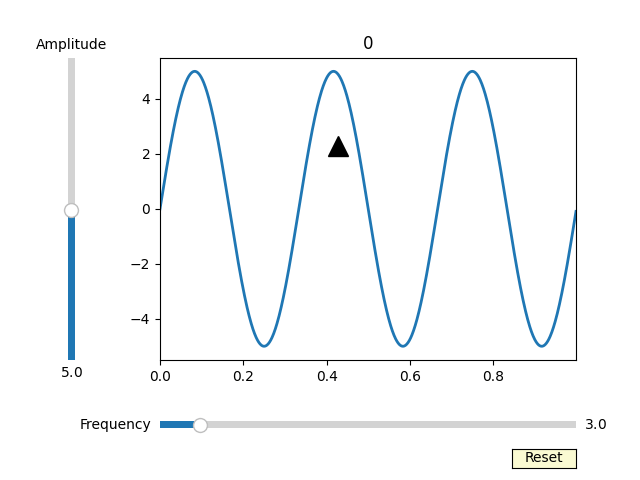

Generate and playback recordings of user interactions with matplotlib figures.
Also integrates with sphinx gallery to automatically embed interactions in the docs without
needing to manually generate gifs. See https://mpl-playback.readthedocs.io/en/latest/gallery/index.html
for an example of this in action.

Example of a rendered gif:

